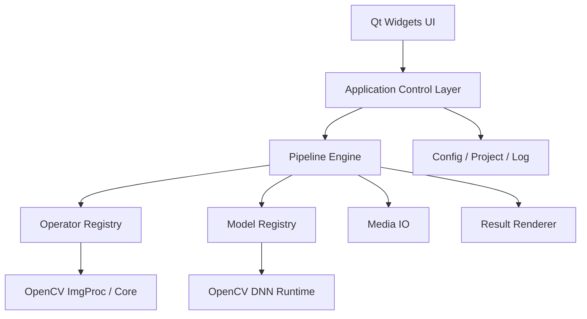

# OpenCV Validation Platform Design

- Date: 2026-06-04
- Target Version: V1
- Target Platform: Windows first release, cross-platform oriented architecture
- Tech Stack: C++17 + Qt Widgets + OpenCV + OpenCV DNN + CMake
- Product Positioning: A desktop validation platform for algorithm and vision R&D, used to verify image processing results, model inference results, and reproducible experiment pipelines

## 0. Local Build Baseline

The current local implementation baseline is:

- Qt 5.14.2
- MinGW 7.3.0 64-bit
- CMake

This does not change the Windows-first and cross-platform-oriented product direction. It only defines the currently validated local desktop build toolchain.

The current validated local SDK pairing is Qt 5.14.2 MinGW with a bundled OpenCV SDK at `opencvsdk/windows/opencv4.12`.

## 1. Product Goals

This project is not aimed at general operators. It is a validation and experiment platform for R&D users who need:

- To verify traditional image processing results quickly
- To import their own ONNX models and validate inference behavior
- To expose as many tunable parameters as possible
- To process both images and videos
- To compare original data, intermediate results, and final results
- To export not only media results, but also structured outputs and reproducible configurations

V1 is released on Windows, but coding and architecture must preserve future portability to Linux and macOS.

## 2. Non-Goals For V1

The following are intentionally not core V1 goals:

- Full plugin sandboxing or multi-process isolation
- Online model conversion service
- Distributed processing
- Full PDF reporting system
- Full OCR-specialized workstation
- Deep annotation workflow integration
- Complex graph-based drag-and-drop workflow editor
- Embedded scripting system such as Python/Lua custom postprocessing

## 3. Recommended Architecture

The recommended route is a modular monolith desktop application.

Reasons:

- Faster to land than a process-split platform
- Easier to maintain than a function-stacked single-window application
- Supports later extension of operators, models, result renderers, and task types
- Keeps UI logic separate from processing logic

High-level architecture:



Layer responsibilities:

- UI: interaction, parameter editing, task launching, result viewing
- Application Control: orchestration between UI and services
- Pipeline Engine: unified processing flow execution
- Operator Registry: traditional operator registration and schema exposure
- Model Registry: ONNX model management and metadata management
- Media IO: image and video reading/writing
- Result Renderer: overlay boxes, masks, keypoints, text, statistics
- Config/Project/Log: persistence, reproducibility, diagnostics

## 4. Unified Processing Abstraction

The central design choice is to abstract both images and videos as a frame stream.

Unified model:

`Source -> Frame -> Pipeline -> Result -> Render / Export`

Interpretation:

- Single image: one-frame stream
- Image folder: multi-frame discrete stream
- Video: continuous timed stream

Benefits:

- Traditional operators and DNN modules implement one frame-processing contract
- Image and video do not require two separate algorithm systems
- Real-time preview and offline processing share the same pipeline definition
- Diagnostics and export logic become consistent across source types

## 5. Core Data Model

### 5.1 FramePacket

The unified carrier object through the processing pipeline.

Recommended fields:

- `frameId`
- `timestampMs`
- `sourceId`
- `originalMat`
- `workingMat`
- `artifacts`
- `tensorOutputs`
- `annotations`
- `metrics`
- `debugTrace`

### 5.2 PipelineDefinition

Describes a reproducible pipeline.

Recommended contents:

- Pipeline name and version
- Ordered step list
- Step parameter snapshots
- Input/output rules
- Visualization rules
- Export rules

### 5.3 PipelineStep

Each processing node can be:

- Traditional operator
- DNN inference
- Postprocessing step
- Rendering overlay
- Export step

Recommended interface:

```cpp
class IPipelineStep {
public:
    virtual ~IPipelineStep() = default;
    virtual QString id() const = 0;
    virtual QString displayName() const = 0;
    virtual StepSchema schema() const = 0;
    virtual StepResult execute(FramePacket& frame, const RunContext& ctx) = 0;
};
```

The `schema()` output must drive automatic parameter UI generation.

### 5.4 TaskDefinition

Represents a runnable job:

- Task type
- Input source set
- Bound pipeline
- Run mode: preview or offline
- Output directory
- Overwrite policy
- Log level

## 6. Functional Modules

V1 should be organized into the following main modules.

### 6.1 Media Management

- Open single image
- Open image set / folder
- Open video
- Drag-and-drop import
- Recent files
- Media information inspection
- Video frame positioning and frame extraction

### 6.2 Traditional Operator Module

V1 operator families:

- Filtering: mean, Gaussian, median, bilateral
- Morphology: erode, dilate, open, close
- Thresholding: fixed, adaptive, Otsu
- Edge detection: Sobel, Canny, Laplacian
- Geometry: resize, crop, rotate, flip
- Color: gray, BGR/RGB, HSV
- Enhancement: histogram equalization, CLAHE
- Basic analysis: contours, connected components, template matching

All operators should expose a parameter schema for UI generation.

### 6.3 DNN Model Module

Core assumptions:

- V1 supports user-provided ONNX models only
- Models are categorized, not hard-coded by business domain
- The platform focuses on model access, configuration, preview, and reproducibility

Recommended built-in model categories:

- Classification
- Object detection
- Semantic segmentation
- Instance segmentation
- Keypoint / pose
- OCR placeholder category
- Custom tensor output

### 6.4 Pipeline Orchestration Module

Supports flows such as:

`Read -> Resize -> Normalize -> ONNX Inference -> NMS -> Render -> Export`

Must support:

- Pure traditional operator chains
- Pure model inference chains
- Mixed operator + model chains
- Step-by-step preview and debugging

### 6.5 Result Presentation Module

Must support:

- Original image
- Processed image
- Overlay result
- Dual-view comparison
- Slider wipe comparison
- Four-view comparison
- Stepwise result browsing
- Statistics side panel

### 6.6 Task Execution Module

Unified handling of:

- Single image preview
- Batch image processing
- Video preview
- Offline video processing

Must provide:

- Progress
- Cancel
- Pause/continue for offline tasks
- Error reporting
- Timing information

### 6.7 Project and Configuration Module

Must save and restore:

- Current media set
- Loaded models
- Current pipeline
- Parameter presets
- Export settings

### 6.8 Log and Diagnostics Module

Must expose:

- OpenCV/DNN load logs
- Input/output tensor shape information
- Per-step timing
- Total timing
- Error details
- Runtime backend information

## 7. Model Access Mechanism

This is the central platform feature.

The design should use dual entry with one internal representation.

### 7.1 Dual Entry Strategy

#### Entry A: Import From Training Platform Output

For users importing results from training ecosystems such as YOLO and other visual training platforms.

Flow:

1. Select ONNX file
2. Select source type such as `YOLO`, `generic detection`, `generic segmentation`, `custom`
3. Read companion information or ask user to fill missing items
4. Auto-generate an initial model configuration
5. Let user review, adjust, and save

Goals:

- Auto-detect input shape and channels
- Pre-fill preprocessing defaults
- Pre-fill thresholds and visualization defaults
- Make common models runnable with minimal edits

#### Entry B: Visual Editor Generated Configuration

For custom models, experimental models, non-standard outputs, or cases where auto-detection is not enough.

The model configuration editor should include tabs:

1. Basic info
2. Input config
3. Preprocessing config
4. Output config
5. Postprocessing config
6. Visualization config

Capabilities:

- Manual editing
- Preview while adjusting
- Save as template
- Clone existing config

### 7.2 Unified Internal Model Package

Regardless of input path, everything lands in a unified model package:

```text
models/
  my_model/
    model.onnx
    model.json
    labels.txt
    preview.png
```

This keeps:

- Model library management consistent
- Project save/restore simple
- Batch processing reproducible
- Sharing and migration predictable

### 7.3 Internal Model JSON

Recommended sections in `model.json`:

- Model identity
- Model category
- Input tensor spec
- Preprocessing spec
- Output tensor spec
- Postprocessing spec
- Visualization spec
- Labels reference
- Notes and version metadata

Model file and interpretation rules must be decoupled.

## 8. UI Design

The UI should be R&D-oriented, not simplified for casual users.

Recommended layout: three-column desktop workstation.

### 8.1 Left Panel

- Media list
- Model list
- Pipeline step list
- Task history

### 8.2 Center Canvas

- Image/video display
- Single view
- Dual view
- Four-grid view
- Overlay rendering

### 8.3 Right Panel

- Full parameter panel for current operator or model
- Reset to default
- Save preset
- Live parameter editing

### 8.4 Top Menu / Toolbar

- File
- Image Processing
- Video Processing
- Models
- Pipeline
- Tasks
- View
- Settings
- Help

### 8.5 Bottom Status Bar

- Cursor coordinates
- Pixel value
- Zoom ratio
- Frame number
- Backend info
- Timing hints
- Log summary

Core workflow:

`Choose media -> Choose operator/model -> Tune parameters -> Preview -> Add to pipeline -> Batch run / Export`

## 9. Image and Video Processing Flow

### 9.1 Image Modes

V1 should support:

- Single-image experiment mode
- Image-set validation mode
- Comparison validation mode

Comparison mode is important for R&D, including:

- Original vs result
- Operator A vs operator B
- Model config A vs config B
- Threshold or parameter variant comparison

### 9.2 Video Preview

Preview is for observation and tuning, not guaranteed full-frame processing.

Recommended strategy:

- Display latest available result
- Allow frame skipping
- Support preview resolution scaling
- Support preview FPS limit
- Support frame step sampling
- Support pause and exact rerun on current frame

This is a `latest-frame-wins` preview policy.

### 9.3 Offline Video Processing

Offline mode is for full validation and export.

Requirements:

- Process frames in sequence
- Execute complete pipeline on every frame
- Pause, continue, cancel
- Progress and ETA
- Optional segment-range processing
- Failure logging

### 9.4 Shared vs Separate Concerns

Shared between preview and offline:

- Pipeline definition
- Operators
- Models
- Parameters
- Postprocessing
- Visualization rules

Separated:

- Frame scheduler
- Buffer queues
- Render refresh policy
- Export write strategy

This prevents preview/offline algorithm divergence.

## 10. Export Design

The platform should export not only result media but also reproducible experiment information.

### 10.1 Media Export

- Processed images
- Processed videos
- Overlay images/videos
- Side-by-side comparison images/videos

### 10.2 Structured Result Export

- `json`: boxes, classes, scores, masks, keypoints, frame metadata
- `csv`: per-image or per-frame summaries
- Tensor summary or selected output values

### 10.3 Experiment Configuration Export

- Pipeline configuration snapshot
- Model configuration snapshot
- Parameter preset snapshot
- Runtime environment summary

### 10.4 Validation Report Export

V1 can keep this lightweight:

- Input summary
- Pipeline steps
- Parameter summary
- Result thumbnails
- Timing summary

## 11. Performance Strategy

The guiding principle is stability first, then optimization.

### 11.1 Thread Separation

- UI thread for interaction and display only
- Background threads for processing

### 11.2 Preview Load Shedding

Allow:

- Lower preview resolution
- Lower preview FPS
- Frame skipping
- ROI-only processing
- Disabling expensive live steps temporarily

### 11.3 Caching

Recommended cache points:

- Loaded model instances
- Stable preprocessing results where applicable
- Video decode buffers
- Optional intermediate snapshots

### 11.4 Model Lifecycle Management

- Do not reload model on every run
- Cache `cv::dnn::Net` by model package
- Control concurrency policy explicitly

### 11.5 Runtime Backend Extension

V1 should keep backend selection extensible:

- CPU
- OpenCL
- CUDA if available

Even if not all are production-ready in V1, architecture should not block them.

### 11.6 Large Task Protection

- Queue limits
- Disk space checks
- Memory usage warning
- Continue batch despite individual failures

## 12. Cross-Platform Engineering Constraints

Even though V1 ships on Windows first, coding rules must preserve portability.

Required rules:

- Build system: CMake
- No direct Win32 dependency in core logic
- Platform differences isolated in `infra/platform`
- Paths and storage handled through Qt and standard filesystem abstractions
- Config and model descriptors stored as JSON
- Resource resolution based on application-relative and standard paths
- Packaging folders reserved for Windows, Linux, and macOS from day one

## 13. Recommended Repository Structure

```text
opencvimageutil/
|-- CMakeLists.txt
|-- cmake/
|-- third_party/
|-- resources/
|   |-- icons/
|   |-- qss/
|   |-- translations/
|   `-- models/
|-- config/
|   |-- app_defaults.json
|   |-- operator_schemas/
|   `-- model_templates/
|-- docs/
|-- opencvsdk/
|   `-- windows/
|-- samples/
|   |-- images/
|   |-- videos/
|   `-- models/
|-- src/
|   |-- app/
|   |-- ui/
|   |-- core/
|   |-- infra/
|   `-- main.cpp
|-- tests/
|   |-- unit/
|   |-- integration/
|   `-- testdata/
`-- packaging/
    |-- windows/
    |-- linux/
    `-- macos/
```

## 14. Core Classes and Services

### 14.1 Application Layer

- `ApplicationContext`
- `ServiceLocator`
- `CommandDispatcher`
- `AppSettings`

### 14.2 Core Services

- `PipelineEngine`
- `OperatorRegistry`
- `ModelRegistry`
- `ModelImportService`
- `TaskScheduler`
- `RenderComposer`
- `ProjectService`

### 14.3 UI Components

- `MainWindow`
- `MediaPanel`
- `PipelinePanel`
- `ParameterPanel`
- `CanvasView`
- `TimelineWidget`
- `ModelConfigEditorDialog`
- `TaskConsolePanel`

## 15. V1 Scope

### 15.1 Must-Have For V1

1. Open images and videos
2. Basic video playback and frame positioning
3. Unified frame-stream processing engine
4. Traditional operator registration and schema-driven parameter panel
5. ONNX model import
6. Model category management
7. Two-entry model configuration flow
8. Single-image preview
9. Video preview
10. Batch image processing
11. Offline video processing
12. Overlay result display
13. Export images/videos/json/csv/config snapshots
14. Logging, timing, and error diagnostics

### 15.2 Deferred To Later Versions

- Plugin hot-loading
- Multi-process sandbox inference
- Built-in model conversion
- Distributed task processing
- Full report generation system
- Deep OCR workstation
- Integrated annotation workflow
- Drag-and-drop graph workflow editor
- User scripting extension

## 16. Milestones

### M1: Foundation

- CMake project setup
- Qt main window skeleton
- Logging/config/resource path base
- `FramePacket`, `PipelineStep`, `PipelineEngine` core interfaces

### M2: Traditional Operator Loop

- Image/video load
- Basic canvas
- Operator registration
- Schema-driven parameter panel
- Single image and preview path

### M3: DNN Loop

- ONNX load
- `ModelDescriptor`
- Model import flow
- Training-platform template import
- Model config editor
- At least two model category flows verified

### M4: Task and Export Loop

- Batch image processing
- Offline video processing
- Export images/videos/json/csv
- Logs, timings, failure records

### M5: Stabilization and Release

- Performance tuning
- Exception handling
- Persistence polish
- Windows packaging
- Cross-platform readiness review

## 17. Recommended Implementation Order

Recommended order:

1. Build `Frame Stream + Pipeline Engine + Canvas`
2. Add traditional operators
3. Add schema-driven parameter system
4. Add ONNX inference and model management
5. Add offline video task execution
6. Add model editor, export, diagnostics, packaging

This sequence ensures a runnable version at the end of each stage.

## 18. Open Source Readiness Recommendations

Because the project is intended for GitHub open source release, the repository should later include at least:

- `README.md`
- `LICENSE`
- `.gitignore`
- `CONTRIBUTING.md`
- `CODE_OF_CONDUCT.md`
- `SECURITY.md`
- `CHANGELOG.md`
- GitHub issue templates
- Pull request template
- CI workflow skeleton

These items are repository-level work and are not blockers for this design spec, but they should be added before public release.

## 19. Final Positioning Statement

This project should be defined as:

An open-source desktop validation platform for computer vision R&D, supporting both traditional OpenCV image processing and user-provided ONNX inference, with unified frame-stream processing for images and videos, full parameter exposure, and reproducible experiment outputs.
